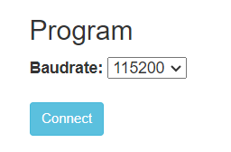
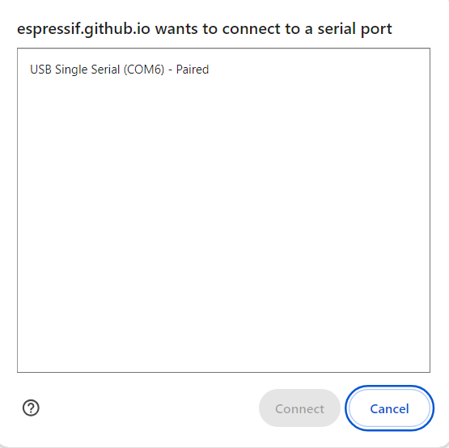
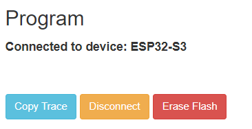
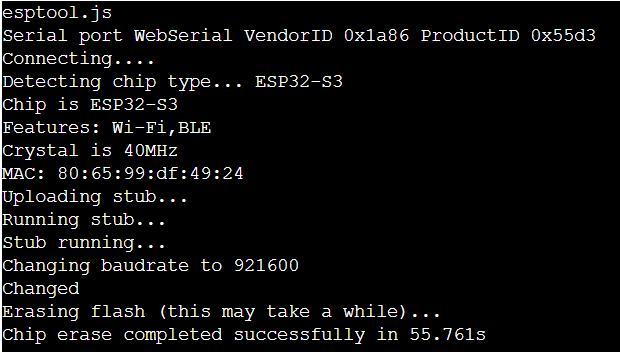
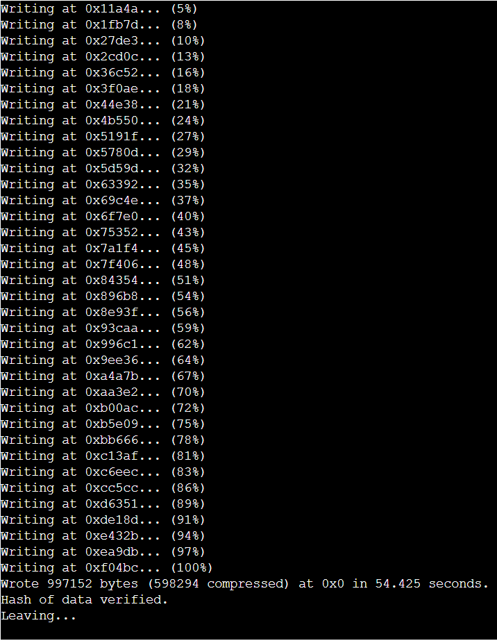
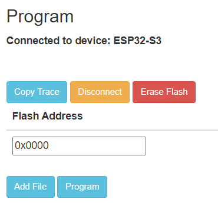
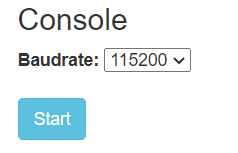
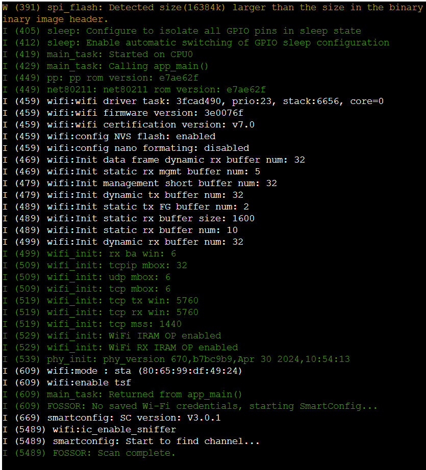

# Browser-based

Instructions to onboard your DIY miner using the ESP Tool web interface

### Prerequisites
* A web browser
* 2.4GHz WiFi connection
* Android or IOS phone
* USB data cable **Make sure your USB cable is a data cable. Many USB cables are power-only and will not work for programming or monitoring!**

### Guide

### Step 1: Download your firmware

* Download the firmware binary and note its location in your filesystem
  * The filename will look something like `***.bin` where `***` is unique to you

### Step 2: Connect to computer

* Use a cable to connect your board to the USB port of your computer
  * Boards have one or two USB connectors; on boards with two, either will work

### Step 3: Open the browser

* Navigate to https://espressif.github.io/esptool-js/

### Step 4: Connect to the serial port

* You may need to install a driver to allow the board to communicate with your computer
  * Instructions are [here](https://docs.espressif.com/projects/esp-idf/en/v5.2.2/esp32s3/get-started/establish-serial-connection.html)

* Under "Program", click <kbd>Connect</kbd>
  * Leave the baud rate set to 115200

* Select the COM port corresponding to your device
    * If there are multiple options and you do not know which one to choose:
      * Close the dialog window and disconnect your board
      * Click on `Connect` and note which port disappeared
      * Close the dialog window and reconnect the board

* After connecting, the console will display information that you have succesfully connected

### Step 5: Erase the flash

* Under "Program", click on <kbd>Erase Flash</kbd>

* The console screen will provide some information:

* The operation should complete quickly:

### Step 6: Flash your device

* Set the flash address from the default `0x1000` to `0x0000`

* Click on <kbd>Choose File</kbd> and select your firmware file from Step 1

* Click on <kbd>Program</kbd>
  * The console should output something like the following:

* Click on <kbd>Disconnect</kbd>

### Step 7: Verify that everything works 

* Under "Console" on <kbd>Start</kbd>

* Select the same port as in Step 4
* Click on <kbd>Connect</kbd> and then <kbd>Reset</kbd>
* If successful, the console should show something like the below:

* In the following steps, you may leave the console connected to monitor the firmware

### Step 8: Connect to WiFi [ESP32 boards only support the 2.4GHz band]

* Download an ESP WiFi config app from your app store
  * The following have been tested
    * [Android](https://play.google.com/store/apps/details?id=com.techbot.smart_config)
    * [IOS](https://apps.apple.com/us/app/smartconnect-for-esp/id1592092325)

* Connect your phone to your WiFi access point

* Open the app and share the password with the device

### Step 9: Set it and forget it

* Monitor the device using the serial console for as long as you like

* Disconnect and plug the device to a 5V power source
  * Any USB adapter should work
  * Average current draw will be about 20mA, spiking to about 0.5A when connecting to WiFi, i.e., the power consumption is about 0.1W
